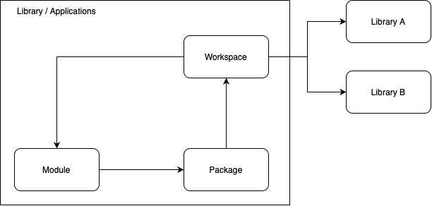

# PACKAGE AND MODULE

### Module

Module is a representation of a file. A file that contains a code

### Package

Package is a representation of a folder. Those package contains multiple module/file.

Package also contains packages as a child package.

### Workspace

Workspace is a representation of a library or applications. This workspace contains multiple packages.

The workspace should be accessible by a module. The best way to do this is by creating a singleton of workspace latter we called as global workspace.

This workspace also contains multiple workspace as libraries.
